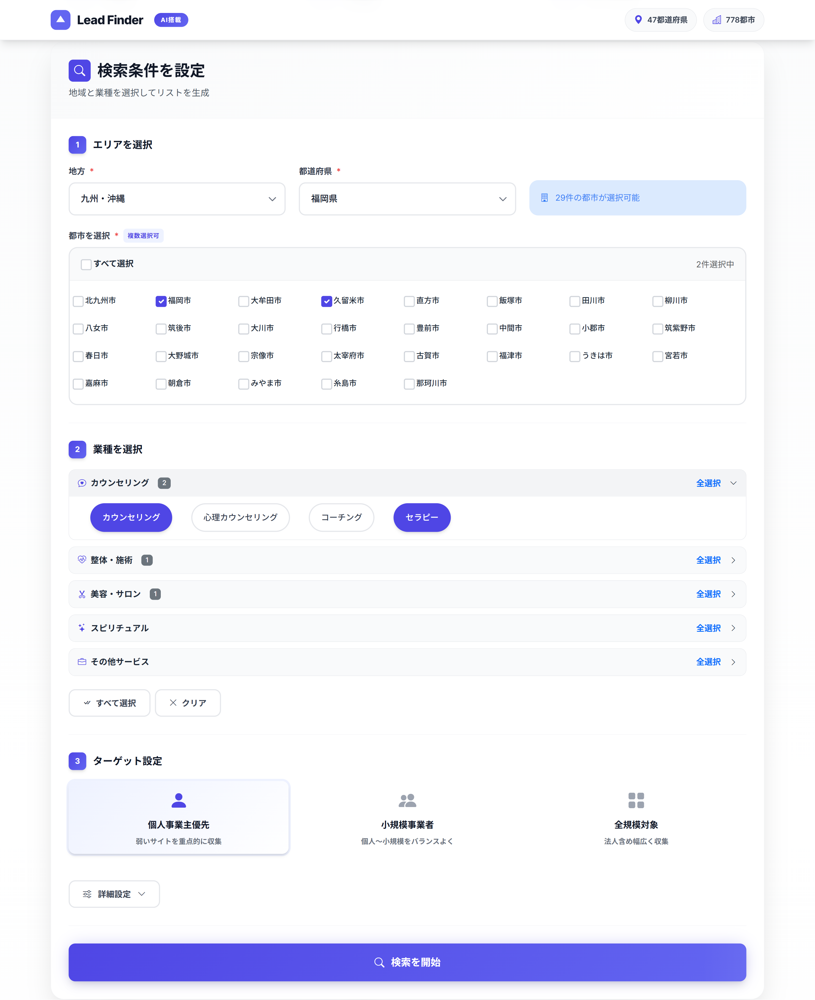
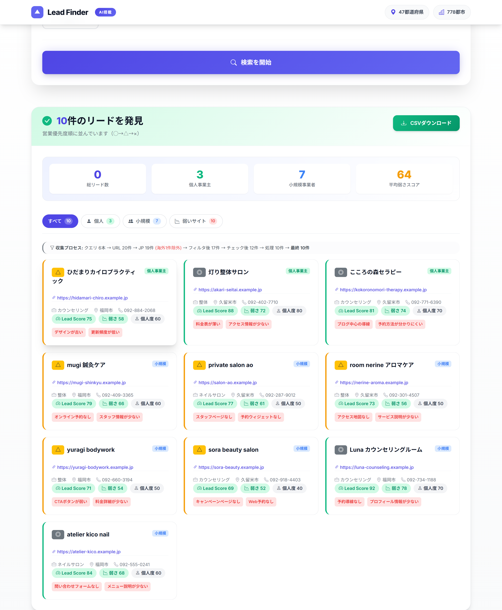

# Lead Finder

Lead discovery, scoring, and operational lead-quality refinement for Japanese small-business outreach.

## Overview

Lead Finder is a working lead discovery and lead-quality refinement system for Japanese local-business outreach. It combines a Flask web app with CLI runners to search for businesses by prefecture, city, and business type, bias collection toward real Japanese local-business sites, score website weakness and business fit, optionally run AI-based relevance and weakness checks, and export reviewable CSVs for downstream outreach work.

This is not a heavy machine learning product. Ranking and filtering are driven by heuristic scoring, deterministic filters, KPI-based evaluation, and iterative tuning work.

## Why This Project Exists

For small-business outreach, the bottleneck is usually not writing a message. It is finding businesses with their own websites, enough local signal, and a realistic improvement opportunity. Lead Finder reduces that manual prospecting work and turns it into a repeatable operational pipeline.

This repository is part of:

`lead-finder -> demo-generator -> outreach automation`

## Core Features

- Flask web app for interactive lead discovery by region, prefecture, city, and business type
- Web app + CLI pipeline for repeatable local-business search and CSV export
- Core 2-pass search strategy, with an additional variation pass when query budget remains
- Japanese-signal and `.jp`-biased search for stronger locality precision
- Hard URL filtering, blocked-domain rules, prechecks, and per-domain caps before expensive processing
- Weakness scoring for website quality and outreach opportunity analysis
- Solo / small / corporate / unknown classification for business size and fit
- Optional AI relevance filtering and AI weakness verification using GPT-4o-mini
- Normalized CSV export with explainability fields, liveness metadata, and optional AI annotations
- Operations tooling for Fukuoka city search, KPI generation, benchmark runs, and precision-first refinement loops

## Screenshots

Search configuration: set target area, business type, score filters, and optional AI checks before running a search.



Scored results: review ranked leads with weakness signals, contact fields, and CSV export support.



## Search and Processing Pipeline

```text
Query generation (core 2-pass; optional variation pass)
  -> URL collection
  -> Japanese/locality filter
  -> prefilter and per-domain caps
  -> hard URL filter
  -> optional AI relevance gate
  -> URL precheck and priority ordering
  -> crawl and process
  -> weakness scoring and size classification
  -> optional post-crawl AI filter
  -> optional AI weakness verification
  -> CSV export and review
```

### 2-pass query strategy

| Stage | Typical query behavior | Purpose |
| --- | --- | --- |
| Pass 1 | Base business query plus signals such as pricing, booking, `site:.jp`, and official-site hints | Get a broad but locality-biased first set of candidates |
| Pass 2 | Expanded queries for low-yield city/business pairs, including solo-home-salon and platform variants | Recover weak but relevant candidates without widening the search globally |
| Variation pass | Additional query variation when budget remains in the web flow | Improve recall after the core 2-pass logic has run |

Pass 2 is only triggered when Pass 1 does not collect enough URLs for a city/business pair. The threshold is controlled by `MIN_URLS_PER_PAIR`.

## Scoring and Classification

### Weakness scoring

The repository uses heuristic weakness scoring rather than a learned model. Representative signals include:

- missing viewport metadata
- missing OGP metadata
- low image count
- thin text content
- no visible booking flow
- no visible pricing information
- no visible contact form
- no SSL
- free-site-builder footprints

Weakness grades are currently grouped as:

- `A`: `60+`
- `B`: `40-59`
- `C`: `<40`

### Business size / fit classification

Solo-business classification combines:

- corporate-term detection
- platform detection
- page-text and site-structure signals
- contact/locality evidence gathered during processing

The resulting classes are `solo`, `small`, `corporate`, and `unknown`.

### AI relevance and AI weakness checks

`src/ai_verifier.py` supports two optional AI stages:

- AI relevance filtering to remove portals, SNS profiles, overseas sites, non-local matches, and other weak targets
- AI weakness verification to re-check the top weakness-ranked leads before downstream use

The relevance stage keeps explicit fields such as `ai_action`, `ai_flags`, `ai_filter_reason`, and `ai_filter_confidence`, and uses a confidence threshold so uncertain cases are not dropped too aggressively.

### CSV output

The canonical output schema is defined in `src/normalize.py` (`FINAL_SCHEMA`). Output can include lead score, weakness score, size classification, contact fields, liveness metadata, source query, and optional AI fields.

## Operational Tuning and Quality Improvement

This repository is not just a scraper. It includes a practical refinement layer for improving lead quality over repeated runs.

- **Iterative threshold tuning:** score bounds, weakness thresholds, locality filters, per-domain caps, and AI confidence gates are adjusted and rechecked against actual output quality.
- **Manual branching of decision rules:** mode-specific configs such as `config/search_terms_fukuoka.json`, `search_terms_fukuoka_A2.json`, `search_terms_fukuoka_A07.json`, and `search_terms_fukuoka_A08.json` make it practical to branch rule sets, compare behavior, and keep or revert changes deliberately.
- **Bayesian-style tuning:** lightweight Bayesian-style tools such as Thompson-sampled query ranking (`tools/thompson_next_queries.py`, `tools/thompson_next_need_queries.py`) and threshold sweeps (`tools/sweep_gmb_thresholds.py`) are used to improve ranking precision without pretending this is a full ML ranking system.
- **KPI-driven refinement:** `tools/kpi_generate.py`, `tools/ops_cycle.py`, and `tools/bench_run.py` generate BEFORE/AFTER KPI reports, gate rule changes, and track a theta-style progress score so changes can be judged against explicit operational metrics.
- **Manual feedback loops:** `tools/init_manual_review_log.py` and `tools/improve_sendable_rules_from_worklog.py` connect exported leads back to human review and sendability outcomes.
- **Operational logging and monitoring:** the web app writes `logs/app.log`, ops loops emit timestamped artifacts under `ops_runs/`, and batch flows write meta JSON and markdown summaries that are easy to tail or collect over SSH when the pipeline is monitored on a remote host.
- **Real-world experimentation:** fixed benchmarks, convergence summaries, and focused regional runners are used to improve selection quality over time instead of treating the first scoring rules as final.

## Configuration

Search behavior can be tuned through config JSON, runtime env vars, and batch-mode switches.

| Knob | Default / examples | Purpose |
| --- | --- | --- |
| `MIN_URLS_PER_PAIR` | `8` | Trigger Pass 2 expansion for low-yield pairs |
| `MAX_URLS_TO_PROCESS` | `400` | Cap the number of URLs processed in the web flow |
| `MAX_QUERIES_TOTAL` | `250` | Cap total search queries |
| `LEAD_PROCESS_WORKERS` | `5` | Control crawl/process concurrency |
| `AI_RELEVANCE_TOP_N` | `30` | Limit AI relevance checks |
| `AI_RELEVANCE_MIN_CONFIDENCE` | `6` | Avoid dropping low-confidence AI cases |
| `MAX_URLS_PER_DOMAIN` | runtime env var | Prevent one domain from dominating a run |
| `FOREIGN_FILTER_MODE` | `strict` or `balanced` | Control non-Japanese / foreign filtering behavior |
| `LEADFINDER_FUKUOKA_QUERY_MODE` | `A2`, `A07`, `A08`, `A09`, `A10` | Switch mode-specific Fukuoka query logic during ops experiments |

## Environment Variables

### Common

| Variable | Required | Used by | Notes |
| --- | --- | --- | --- |
| `OPENAI_API_KEY` | No | AI relevance filter / AI weakness verification | Enables GPT-4o-mini steps |
| `BING_API_KEY` | No | Search layer | Optional Bing integration |
| `BRAVE_API_KEY` | No | Search layer | Optional Brave integration |
| `TIMEOUT` | No | Core pipeline | Default request timeout in `config/settings.py` |
| `MAX_RETRIES` | No | Core pipeline | Retry count in `config/settings.py` |
| `RATE_LIMIT_DELAY` | No | Core pipeline | Delay between requests |
| `PARALLEL_WORKERS` | No | Core pipeline | Default worker count for generic CLI runners |
| `MAX_RESULTS_PER_QUERY` | No | Core pipeline | Default query result cap |
| `BATCH_SIZE` | No | Core pipeline | Batch-oriented processing knob |

### Web app

| Variable | Required | Used by | Notes |
| --- | --- | --- | --- |
| `SECRET_KEY` | No | `web_app/app.py` | Flask session secret; defaults to a dev value |
| `PORT` | No | `web_app/app.py` | Default `5000` |
| `DEBUG` | No | `web_app/app.py` | Flask debug toggle |
| `MIN_URLS_PER_PAIR` | No | Web search flow | Pass 2 trigger threshold |
| `MAX_URLS_TO_PROCESS` | No | Web search flow | URL processing cap |
| `MAX_QUERIES_TOTAL` | No | Web search flow | Total query budget |
| `LEAD_PROCESS_WORKERS` | No | Web search flow | Crawl/process worker count |
| `AI_RELEVANCE_TOP_N` | No | Web search flow | Max leads/URLs sent to AI relevance checks |
| `AI_RELEVANCE_MIN_CONFIDENCE` | No | Web search flow | Minimum confidence to drop |
| `MAX_URLS_PER_DOMAIN` | No | Web search flow | Per-domain cap before crawling |
| `FOREIGN_FILTER_MODE` | No | Web search flow | `strict` or `balanced` |

### Optional batch / ops integrations

| Variable | Required | Used by | Notes |
| --- | --- | --- | --- |
| `GOOGLE_APPLICATION_CREDENTIALS` | No | Sheets / site-generator tools | Service account JSON path |
| `SHEETS_SPREADSHEET_ID` | No | Sheets / pipeline tools | Spreadsheet target |
| `LEADFINDER_FUKUOKA_QUERY_MODE` | No | `tools/run_fukuoka_city_search.py` | Select mode-specific Fukuoka query behavior |
| `SERPEX_API_KEY` / `SERPER_API_KEY` | No | Specialized collectors in `tools/` | Used by Serpex / Serper-based collection flows |
| `GOOGLE_MAPS_API_KEY` | No | `tools/collect_gmb_fukuoka.py` | Used for GMB-focused tooling |

## Testing

Run the main test suite from the repository root:

```bash
python -m pytest tests -q
```

The test suite covers filtering, normalization, scoring, CSV output, Fukuoka query modes, platform detection, KPI generation, `ops_cycle`, benchmark summaries, and theta/convergence helpers.

## Benchmark / ops_cycle

`tools/ops_cycle.py` is a precision-first operational refinement loop, not a generic model trainer.

Core flow:

1. take a deterministic CSV slice
2. generate BEFORE KPI / report artifacts
3. propose a minimal precision patch from KPI diagnostics
4. generate AFTER KPI / report artifacts
5. accept only when mandatory gates pass and theta improves
6. emit timestamped run artifacts under `ops_runs/<timestamp>/`

Example commands:

```bash
python -m tools.ops_cycle --input web_app/output/merge_fukuoka_all_queries.csv --slice 200 --mode B
python -m tools.bench_run --mode B --slice 200
python scripts/collect_theta_convergence.py
```

Operational artifacts include:

- `ops_runs/<timestamp>/...` run logs, KPI JSON, KPI reports, patch details, and validation outputs
- `BENCH_SUMMARY.md` and `BENCH_SUMMARY.json` for fixed benchmark suites
- convergence reports that compare theta and KPI movement across repeated runs

The benchmark layer is meant to catch regressions, overfitting, and false precision gains before filter changes become the new default.

## CLI / Batch Workflows

### Recommended web app

```bash
python -m venv .venv
# Windows
.venv\Scripts\activate
# macOS / Linux
source .venv/bin/activate

pip install -r requirements.txt
pip install -r web_app/requirements.txt

cd web_app
python app.py
```

Open `http://localhost:5000`.

### Fukuoka city search runner

```bash
python -m tools.run_fukuoka_city_search \
  --config config/search_terms_fukuoka.json \
  --output-dir web_app/output \
  --max-queries 300 \
  --max-results-per-query 5 \
  --parallel-workers 6
```

This runner expands a Fukuoka-focused query dictionary, keeps ordering deterministic, and writes outreach-oriented CSV plus meta JSON output.

### General CLI paths

```bash
python advanced_search.py --region <jp-region-key> --test --output output/advanced_region_test.csv
python main.py --queries data/queries.txt --output output/leads.csv
python -m tools.init_manual_review_log --output web_app/output/manual_review_log_template.csv
```

Use `tools/run_full_search.py` and `tools/pipeline.py` for broader Sheets-oriented flows.

## Project Structure

```text
lead-finder/
|-- web_app/                # Recommended UI/API entry point
|-- src/                    # Core crawling, scoring, filtering, normalization
|-- tools/                  # Batch runners, ops loops, KPI utilities, and reports
|-- config/                 # Search configs and settings
|-- tests/                  # Pytest suite
|-- scripts/                # One-off verification and maintenance helpers
|-- site-generator/         # Secondary utility, not the main lead-finder entry path
|-- advanced_search.py      # General CLI runner built on src/
|-- main.py                 # General CLI runner built on src/
|-- app.py                  # Older standalone CLI path
`-- requirements.txt        # Core pipeline dependencies
```

Notes:

- `web_app/app.py` is the main recommended entry point for public/demo use.
- `tools/run_fukuoka_city_search.py` is the clearest current batch runner.
- `tools/ops_cycle.py`, `tools/kpi_generate.py`, and `tools/bench_run.py` are the core refinement / tuning loop utilities.
- Root `app.py` together with `fetcher.py`, `parser.py`, `searcher.py`, `scorer.py`, and `deduplicator.py` appears to be an older standalone path kept for compatibility.

## Limitations

- Search quality depends on external search engines and the current state of target websites.
- This is a heuristic and operations-driven ranking system, not a large learned ranking model.
- AI steps are optional and require `OPENAI_API_KEY`.
- The repository contains historical scripts and utilities, so the public surface area is broader than the main product path.
- The most clearly developed batch workflow is the Fukuoka-focused tooling in `tools/` and `config/`.
- Some ops and experimental utilities are domain-specific and should be read as practical internal tooling, not as a polished packaged platform.

## Related Repositories

- `ai-sales-automation-system` - portfolio overview of the full workflow
- `demo-generator` - generates tailored pages/assets from selected leads
- `playwright-automation` - handles browser-based outreach execution

## License

No license file is currently checked into this working tree.
